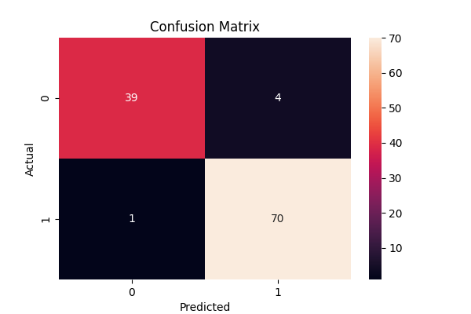

# 🤖 Breast Cancer Prediction (Machine Learning)

## 📌 Project Overview

This project uses machine learning to predict whether a tumor is malignant or benign using real-world medical data.

---

## 🛠️ Technologies Used

* Python
* Pandas
* Scikit-learn
* Matplotlib
* Seaborn

---

## 📂 Dataset

* Built-in dataset from sklearn (Breast Cancer Dataset)
* Contains medical features like radius, texture, smoothness, etc.

---

## ⚙️ Model Used

* Logistic Regression

---

## 📊 Model Performance

* Achieved ~95% accuracy
* Evaluated using confusion matrix

---

## 📈 Output Visualization



---

## ▶️ How to Run

1. Install dependencies:

```id="k6m2lw"
pip install pandas scikit-learn matplotlib seaborn
```

2. Run:

```id="24cb4g"
python main.py
```

---

## 💡 Key Learnings

* Data preprocessing
* Model training and evaluation
* Classification techniques
* Visualization of ML results

---

## 🚀 Future Improvements

* Try advanced models (Random Forest, XGBoost)
* Hyperparameter tuning
* Deploy model using Flask

---

## 👩‍💻 Author

Tarushi Mahesh

